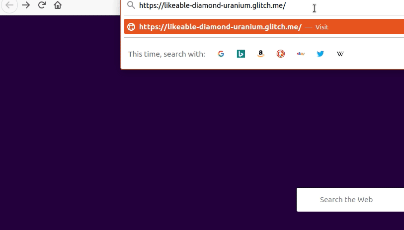

# Request Header Parser Microservice

[Live site on Glitch](https://likeable-diamond-uranium.glitch.me/)  

  

## Instructions
Click go to https://likeable-diamond-uranium.glitch.me/api/whoami to get user IP, Language and Software

 
Example Output  
{
ipaddress: "192.168.0.0",
language: "en-US,en;q=0.9,de-DE;q=0.8,de;q=0.7",
software: "Mozilla/5.0 (X11; Linux x86_64) AppleWebKit/537.36 (KHTML, like Gecko) Chrome/83.0.4103.106 Safari/537.36"
}

## Built With

* [Node JS](https://nodejs.org/en/)  

## Acknowledgments

* This project idea is from freeCodeCamp    
